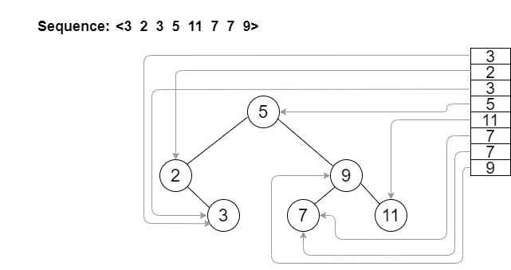

# sequence


- [Installation](#anc1)
- [Usage](#anc2)
- [Contribution](#anc3)
- [How It Work](#anc#4)
- [License](#anc5)

---

Project contain realisation of Sequence, which can be used as library C++. In general, it provides an basic interface for create and working with a Sequence.

<a id="anc1"></a>

## Installation
- The sources for Sequence can be downloaded from the [Github repo](https://github.com/rrtty0/sequence.git).

* You can either clone the public repository:
```
        $ git clone https://github.com/rrtty0/sequence.git 
```

<a id="anc2"></a>

## Usage
This project may be used as a library with functionality and realisation of Sequence for your project. For it, move files [Sequence.h](./source/Sequence.h) and [Sequence.cpp](./source/Sequence.cpp) at __*your project's work directory*__, include [Sequence.h](./source/Sequence.h) as a header file at your source, like that:
```C++
# include "Sequence.h"

//your code...
```

<a id="anc3"></a>

## Contribution
1. _Clone_ repo and _create_ a new branch:
```
        $ git clone https://github.com/rrtty0/sequence.git
        $ git branch name_for_new_branch
        $ git checkout name_for_new_branch
```
2. _Make changes_ and test
3. _Submit Pull Request_ with comprehensive description of changes


<a id="anc4"></a>

## How It Work
The implemented sequence is an indexed AVL-Tree that stores the elements that are passed to it and their order (unlike the classical sequence, it can store duplicate elements). Thus, this is an implementation of the classic AVL-Tree, but with the ability to store the order of elements, as well as duplicates.
An example of storing a sequence:


<a id="anc5"></a>

## License
Source Available License Agreement - [GNU v3.0](./LICENSE).